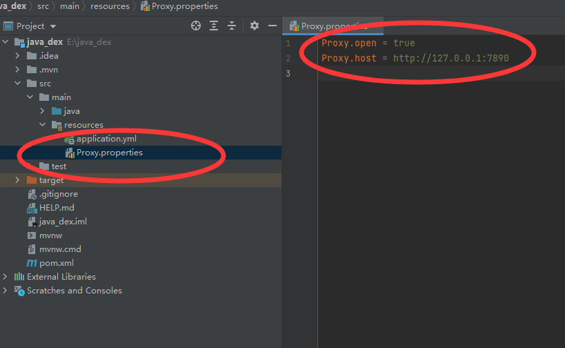

# 基于区块链不同Dex的Perpetual价差分析系统

### 用java实现的一套完整的Dex价差分析系统，能收集不同交易所之间的Perpetual价格，进行同一时间（精确到秒）的价格对比，从而获得套利机会。利用TDengine数据库、redis、element-ui、Vue、java、vue-echart

## 配置

为了使用环境方便，提供代理配置，在后端 Proxy.properties 文件下，配置开启和代理地址

开启后端项目 端口在8080

# 前端

开启项目：

`npm run dev `

端口在8002

#### 创建一个任务

#### 查看任务列表 开启后收集数据

#### 成功！ 开始分析价差

## 注意
前端有些许简陋，但不影响使用。需要其他平台数据，需要在后端二次开发

# 联系我                ---萧枫
本人热爱技术，钻研，欢迎志同道合的兄弟一起研究讨论
邮件：1098516987@qq.com      CSDN:[https://blog.csdn.net/VB551](https://blog.csdn.net/VB551)

# 转载发表请注明原文地址  [https://github.com/imsellbaox/Java_Dex](https://github.com/imsellbaox/Java_Dex)
