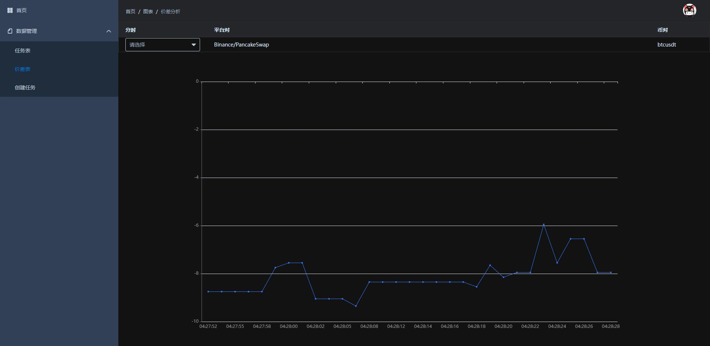

# 基于区块链不同Dex的Perpetual价差分析工具

###简介 用java实现的一套完整的CEX和DEX行情价差分析工具，能收集不同交易所之间的Perpetual价格，进行同一时间（精确到秒）的价格对比，从而评估是否存在套利机会。目前主要实现了BINANCE和PANCAKESWAP的永续合约的比对，其他交易所和交易对后续有空在完善

###技术栈
项目使用到了TDengine数据库、redis、管理系统修改自node-elm，该项目使用了element-ui、Vue、java、vue-echart

## 配置
1、根据情况配置TDengine数据库、redis，在后端resources目录下的application.yml

3、为了使用环境方便，提供代理配置，在后端 Proxy.properties 文件下，配置开启和代理地址，如：

##启动

1. 启动TDengine数据库，启动redis

2. 在后端目录下执行：打包项目为jar包

   `mvn clean package -Dmaven.test.skip=true`
   找到target文件，`java -jar java_dex-0.0.1-SNAPSHOT.jar  `   开启后端

3. 进入前端，先安装依赖：

   `npm install`

4. 开启前端模块：

   `npm run dev `

##前端UI

#### 创建一个任务

#### 查看任务列表 开启后收集数据

#### 成功！ 开始分析价差

## ToDo
- 尽可能解耦和接口化交易所行情获取部分，以便接入更多交易所只需完成对应的交易所实现接口即可
- DEX交易所现货行情获取模块（从第三方平台或者部署交易节点获取）
- DEX交易所现货没有orderbook，需要考虑此部分的数据库设计
- 行情数据可能存在无效数据，需要考虑数据清洗模块和接口
- 集成消息推送到telegram或者钉钉

## 注意
前端有些许简陋，但不影响使用。需要其他平台数据，需要在后端二次开发

# 联系我                ---萧枫
本人热爱技术，钻研，欢迎志同道合的兄弟一起研究讨论
邮件：1098516987@qq.com      CSDN:[https://blog.csdn.net/VB551](https://blog.csdn.net/VB551)

# 转载发表请注明原文地址  [https://github.com/imsellbaox/Java_Dex](https://github.com/imsellbaox/Java_Dex)
